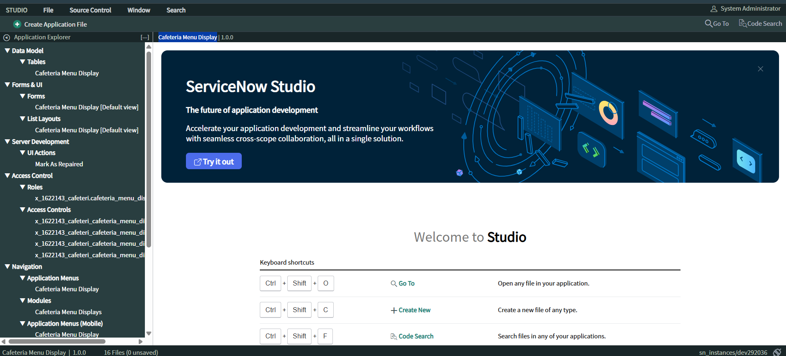
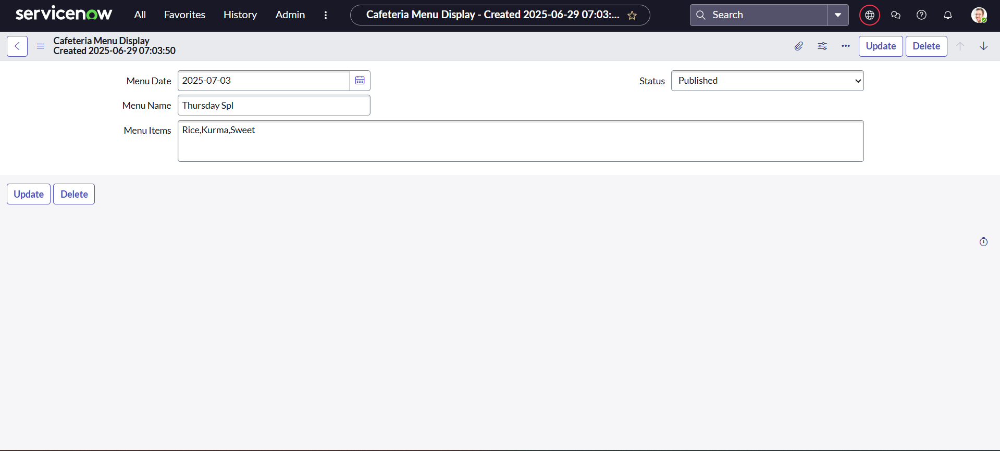
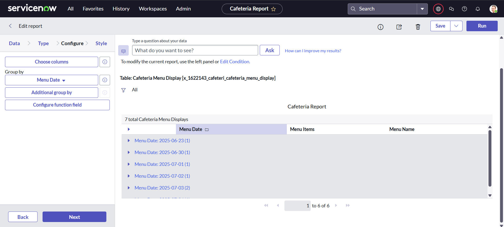
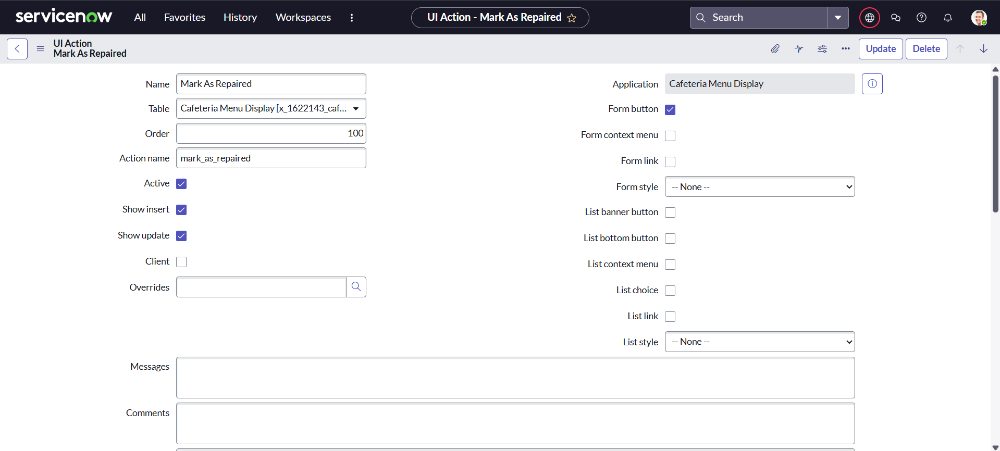

# 🍽️ Cafeteria Menu Display – ServiceNow Application

This project is a ServiceNow-based solution to manage, publish, and view cafeteria menus efficiently. It helps cafeteria admins to schedule meals, display menu details, and allows users to view and place menu requests in a structured and automated way.

---

## 📌 Features

- 📝 **Admin Menu Entry**: Admins can create cafeteria menu entries using a custom ServiceNow table.
- 📆 **Menu Management**: Add details like Menu Name, Menu Items, and Menu Date.
- 📋 **UI Action**: One-click menu publishing using a custom UI button.
- 📦 **Service Catalog**: End users can request/view cafeteria menus through the catalog.
- 📊 **Reports**: Automatically generate daily or weekly menu reports grouped by menu date.

---

## 🏗️ Modules Included

### 1. Table
- **Cafeteria Menu Display**
  - Fields: Menu Name, Menu Date, Menu Items, Status

### 2. Service Catalog
- **Catalog Item**: Submit new cafeteria menu
  - Variables: Menu Name, Menu Date, Menu Items

### 3. UI Action
- **Mark As Published**: Updates the status of the menu to "Published"

### 4. Reports
- **Cafeteria Report**
  - Grouped by: Menu Date
  - Columns: Menu Name, Menu Items, Menu Date

---

## 🚶 Real-World Use Case

- **Admin Role**:
  - Creates the weekly menu
  - Publishes it using the UI Action button

- **End User Role**:
  - Views available menus via reports
  - Orders from the menu using the service catalog form

---

## ✅ How to Use

1. **Studio Setup**: Create application `Cafeteria Menu Display` in ServiceNow Studio.
2. **Create Table**: Add `Menu Name`, `Menu Date`, `Menu Items`, and `Status` fields.
3. **Service Catalog**: Create a catalog item for menu submission.
4. **UI Action**: Add “Mark As Published” to change the menu status.
5. **Reports**: Build a list report grouped by date.
6. **Test**: Try submitting menus and viewing the report and catalog items.

---

## 📸 Screenshots

### 🎯 Studio Dashboard

### 📋 Menu Table

### 🛒 Service Catalog

### 📊 Report View

### 🔘 UI Action Button

---

## 🎥 Demo

Watch the demo video here:  
🔗 [Demo Video on Google Drive](https://drive.google.com/file/d/1wFffABuLwg2ptjIWr0ecMGXJYzIP4D3_/view?usp=drive_link)

---

## 📂 Project Structure

Cafeteria Menu Display/
├── Tables/
│ └── Cafeteria Menu Display
├── UI Actions/
│ └── Mark As Published
├── Catalog/
│ └── Submit new cafeteria menu
├── Reports/
│ └── Cafeteria Report

---

## 🏁 Conclusion

This project highlights how ServiceNow can be extended to solve real-world cafeteria management issues using low-code automation, UI actions, and catalog items.

---

## 💡 Future Scope

- Integrate approval workflows for menu submission.
- Send automatic notifications to employees when menus are updated.
- Enable dynamic weekly planning and filtering.

---

## 📎 Appendix

- **Source Code**: Available inside the ServiceNow application
- **Dataset**: Not applicable
- **Demo Link**: [Demo Video](https://drive.google.com/file/d/1wFffABuLwg2ptjIWr0ecMGXJYzIP4D3_/view?usp=drive_link)

---

> ✨ Built with ❤️ on ServiceNow Platform

